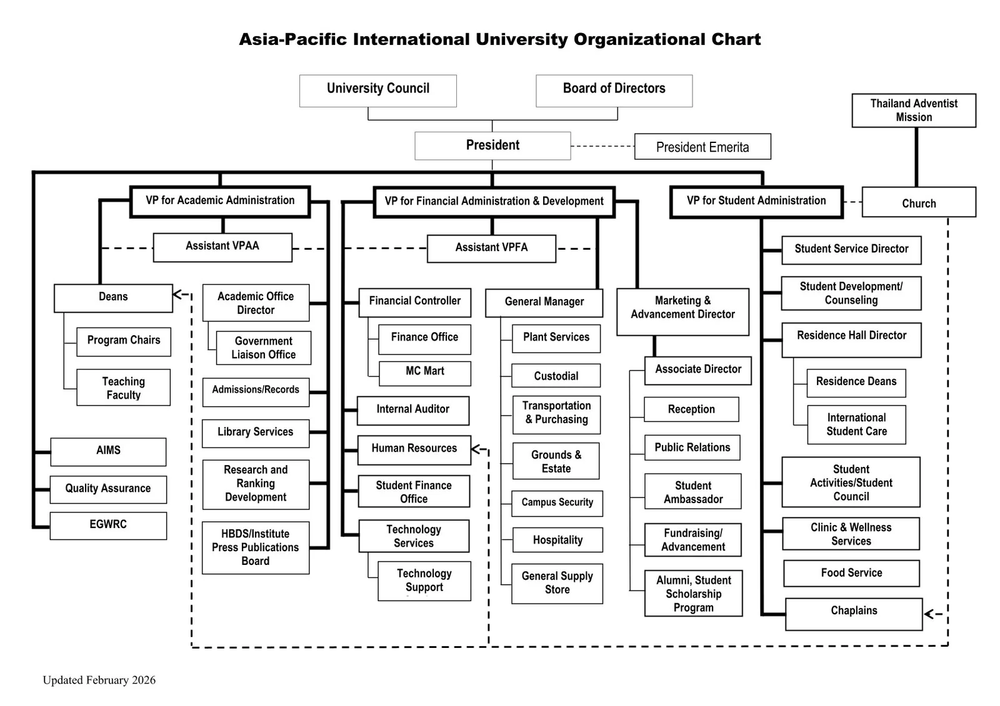

# AI-Powered Indoor Surveillance Robot

## Senior Project Proposal Draft

**Student:** Peeranat K.  
**Institution:** Asia-Pacific International University  
**Faculty:** Faculty of Information Technology  
**Academic Year:** 2025–2026, Semester 2  

---

## Table of Contents

1. [Introduction](#1-introduction)
   - 1.1 [Project Objectives](#11-project-objectives)
2. [Related Works](#2-related-works)
3. [Preliminary Investigation](#3-preliminary-investigation)
   - 3.1 [Company Profile](#31-company-profile)
   - 3.2 [Organizational Chart](#32-organizational-chart)
   - 3.3 [Statement of Mission/Goal of the Organization](#33-statement-of-missiongoal-of-the-organization)
   - 3.4 [Project Request](#34-project-request)
   - 3.5 [Description of the Problem](#35-description-of-the-problem)
   - 3.6 [Project Scopes and Constraints](#36-project-scopes-and-constraints)
   - 3.7 [Expected Business Benefits](#37-expected-business-benefits)
   - 3.8 [Expected System Capabilities](#38-expected-system-capabilities)
   - 3.9 [Planning](#39-planning)

---

## 1. Introduction

This project focuses on the development of an autonomous indoor surveillance robot using a Raspberry Pi 4 and AI technologies (such as computer vision and machine learning). The robot is designed to patrol the main hall of a university building, monitor the surrounding environment, detect human presence, and provide security alerts during restricted hours (after 10:00 PM).

The system is built on a **subsumption architecture**, a layered control framework where lower layers handle reactive behaviors using local code (such as obstacle avoidance and basic motor control) and higher layers implement AI-driven behaviors (such as human detection, zone recognition, and intelligent decision making). Higher-priority layers can suppress or override lower-layer actions when needed, enabling the robot to operate reliably with simple reactive control while benefiting from AI reasoning at the top level. The robot processes visual data using a Raspberry Pi camera and AI-based image processing to understand its environment. It is capable of detecting human presence, recognizing key locations within the hall, and identifying exit areas to prevent leaving the designated patrol zone.

### Problem Description

University buildings, particularly main halls, require continuous monitoring during restricted hours (after 10:00 PM) to ensure security and safety. This project proposes to enhance security by deploying a mobile surveillance robot equipped with AI capabilities to autonomously patrol alongside security personnel, detect unauthorized human presence, and provide immediate alerts.

### Project Importance

This project is important for the university stakeholders because it:

- **Addresses the security gap** in nighttime monitoring of the main hall by supplementing manual walkthroughs with continuous autonomous patrol.
- **Enhances response time** through automated email alerts with captured images, enabling security staff to act immediately upon unauthorized presence.
- **Demonstrates innovation** in applying AI and robotics to campus security, supporting the university's commitment to leveraging technology.

### 1.1 Project Objectives

#### 1.1.1 General Objective

To design, develop, and deploy an AI-powered autonomous indoor surveillance robot using Raspberry Pi 4 and AI technologies that can patrol a university main hall, detect human presence, and provide security alerts during restricted hours.

#### 1.1.2 Specific Objectives

1. **Build the robot platform:** Design and build a mobile surveillance robot platform using Raspberry Pi 4 as the main controller with a four-wheel drive system and ultrasonic obstacle avoidance.

2. **Implement human detection:** Implement real-time environment monitoring and human detection using a Raspberry Pi Camera Module and AI-based image processing, capable of capturing images of any person detected after 10:00 PM.

3. **Train a zone recognition model:** Develop and train an AI model for location/zone recognition inside the main hall, enabling the robot to identify its position based on visual features.

4. **Implement virtual boundary detection:** Implement a virtual boundary detection system using image classification that recognizes exit doors and outside areas, preventing the robot from leaving the designated patrol zone.

5. **Develop an email alert system:** Develop an automated email alert system using SMTP protocol that captures an image and sends a notification when human presence is detected after 10:00 PM.

6. **Implement subsumption architecture:** Implement a layered subsumption control architecture where lower layers handle reactive behaviors through local code (obstacle avoidance, motor control, basic patrol navigation) and higher layers provide AI-driven capabilities (human detection, zone recognition, LLaMA-based decision making), with higher layers able to suppress lower-layer actions when needed.

7. **Integrate AI decision support:** Integrate a LLaMA-based AI model as the highest layer of the subsumption architecture for high-level decision support and environmental reasoning, combining local processing with AI-assisted interpretation.

8. **Evaluate system performance:** Evaluate the system's performance in terms of detection accuracy, patrol coverage, response time, and reliability of alerts.

---

## 2. Related Works

Several existing solutions in the domain of indoor surveillance and security robotics were reviewed to understand current approaches and identify opportunities for improvement.

### 2.1 Knightscope K5 Autonomous Security Robot

Knightscope developed the K5 autonomous security robot, used in commercial environments such as malls and parking lots. The K5 uses a combination of sensors, cameras, and GPS for navigation and surveillance. It can detect anomalies and alert security personnel. However, it is designed for outdoor use, is commercially expensive, and requires dedicated infrastructure for deployment.

### 2.2 Cobalt Robotics Indoor Security Robot

Cobalt Robotics offers an indoor security robot that patrols office buildings and corporate spaces. It combines autonomous navigation with human-in-the-loop monitoring, allowing remote operators to interact with people through the robot. While effective for corporate settings, it relies on expensive hardware and cloud-based services, making it less suitable for educational institutions with limited budgets.

### 2.3 AI-Based Human Detection Systems

Numerous open-source projects utilize AI technologies for human detection. These systems have demonstrated the effectiveness of various detection algorithms and deep learning-based detectors for real-time human detection on embedded platforms like Raspberry Pi. These projects typically focus on stationary camera setups rather than mobile robotic platforms.

### 2.4 Raspberry Pi-Based Surveillance Systems

Several academic and hobbyist projects have explored Raspberry Pi-based surveillance cameras with motion detection and email notification capabilities. These systems typically use the Pi Camera Module with AI-based techniques for motion and human detection. However, most are stationary and do not incorporate autonomous navigation or zone recognition.

### 2.5 Subsumption Architecture in Robotics

The subsumption architecture, introduced by Brooks (1986), is a reactive robotic control framework that organizes behavior into layers of increasing competence. Lower layers handle simple, fast reactive behaviors (e.g., obstacle avoidance), while higher layers implement more complex behaviors (e.g., goal-directed navigation, intelligent perception). A key principle is that higher layers can suppress or inhibit lower-layer outputs, allowing the robot to default to safe reactive behavior while layering on sophisticated AI reasoning when available. This architecture is well-suited for embedded robotic systems because each layer can operate independently, ensuring robustness even if higher-level AI processing is delayed or unavailable. The proposed system adopts this architecture to separate local code control (motor control, obstacle avoidance) from AI-driven behaviors (human detection, zone recognition, LLaMA-based decision making).

### 2.6 LLaMA-Based AI Decision Systems

Recent developments in large language models, particularly the LLaMA family of models, have shown promise for edge-based AI reasoning. These models can be optimized for embedded deployment to provide contextual decision-making capabilities. Integration of such models with robotic systems is an emerging research area.

### Advantages of the Proposed System

Compared to existing solutions, this project offers several advantages:

| Feature | Knightscope K5 | Cobalt Robotics | AI Projects | Pi Surveillance | **Proposed System** |
|---|---|---|---|---|---|
| Low cost (student budget) | ✗ | ✗ | ✓ | ✓ | **✓** |
| Mobile patrol | ✓ | ✓ | ✗ | ✗ | **✓** |
| Human detection | ✓ | ✓ | ✓ | ✓ | **✓** |
| Zone recognition | ✗ | ✗ | ✗ | ✗ | **✓** |
| Virtual boundary enforcement | ✗ | ✗ | ✗ | ✗ | **✓** |
| Automated email alerts | ✗ | ✓ | ✗ | ✓ | **✓** |
| AI decision support (LLaMA) | ✗ | ✗ | ✗ | ✗ | **✓** |
| Subsumption architecture (layered control) | ✗ | ✗ | ✗ | ✗ | **✓** |
| Designed for indoor university use | ✗ | ✗ | ✗ | Partial | **✓** |

---

## 3. Preliminary Investigation

### 3.1 Company Profile

| Field | Details |
|---|---|
| **Organization** | Asia-Pacific International University (AIU) |
| **Address** | 195 Moo 3, Muak Lek, Saraburi 18180, Thailand |
| **Line of Business** | Higher Education Institution |
| **Contact** | Faculty of Information Technology Office |

**Stakeholders:**

1. **Security Department, AIU** – Responsible for campus security and nighttime monitoring.
2. **Faculty of Information Technology** – Provides academic supervision for the senior project.
3. **Building Management Office** – Responsible for main hall operations and access control.

### 3.2 Organizational Chart



> **Project-relevant units:**
> - **Faculty of IT** (under VP for Academic Administration → Deans) — provides academic supervision for the senior project.
> - **Campus Security** (under VP for Financial Administration & Development → General Manager) — primary end-user stakeholder responsible for nighttime hall monitoring.

### 3.3 Statement of Mission/Goal of the Organization

Asia-Pacific International University's missions are:

1. To produce graduates with virtuous characters and high moral standards based on biblical teaching, along with sound wisdom and practical skills;
2. To be active in research and innovation in each academic faculty with findings published in national and international media;
3. To be engaged in academic service and other humanitarian programs designed to selflessly serve the church, including local, regional, and international needs;
4. To encourage the preservation of arts and culture;
5. To employ an administrative system that meets international quality standards and is noted for its effectiveness and efficiency;
6. To achieve financial stability and promote environmental friendliness.

This project aligns with **Mission 2** (research and innovation) by applying AI and robotics technologies to address a real-world campus security challenge, and with **Mission 5** (effectiveness and efficiency) by enhancing the university's security operations through an automated surveillance system that complements existing personnel.

### 3.4 Project Request

This project was initiated as a Senior Project (IT483/IT484) at the Faculty of Information Technology, Asia-Pacific International University. The project was proposed by the student in response to the identified need for enhanced security monitoring of the university's main hall during restricted hours (after 10:00 PM). The project combines the student's interest in robotics and artificial intelligence to address a practical campus security challenge.

### 3.5 Description of the Problem

The main hall of the university building is a high-traffic area during the day but requires security monitoring during nighttime restricted hours (after 10:00 PM). Currently, security monitoring relies on periodic manual walkthroughs by security personnel, which is:

1. **Inconsistent:** Human patrols may miss certain areas or time periods.
2. **Limited in coverage:** Guards cannot monitor all areas simultaneously.
3. **Reactive rather than proactive:** Human patrols react to incidents rather than continuously monitoring.
4. **Subject to human fatigue:** Guards working night shifts may experience fatigue, reducing alertness.

There is no automated system in place to continuously monitor the main hall, detect unauthorized human presence, and immediately alert security personnel. This creates a security gap that could lead to unauthorized access, theft, vandalism, or safety incidents going undetected.

The proposed AI-powered surveillance robot addresses this problem by providing continuous, autonomous patrol with real-time human detection and automatic alert capabilities, working alongside existing security personnel to enhance overall coverage.

---

### 3.6 Project Scopes and Constraints

#### In-Scope

**Functions and Features:**

- Autonomous indoor patrol within the university main hall using a four-wheel drive system.
- Real-time video capture and processing using Raspberry Pi Camera Module and AI-based image processing.
- Human detection using AI-based detection techniques (deep learning-based models or similar approaches).
- Zone/location recognition inside the hall using a trained AI-based image classification model.
- Virtual boundary detection to prevent the robot from exiting the hall using image classification of exit doors and outside areas.
- Obstacle avoidance using HC-SR04 ultrasonic distance sensor.
- Automated email alerts via SMTP when human presence is detected after 10:00 PM, including captured images and timestamps.
- Layered subsumption control architecture separating reactive local code control (lower layers) from AI-driven decision making (higher layers).
- AI-assisted decision making using a LLaMA-based model as the highest control layer for high-level reasoning.

**Data (Input and Output):**

| Type | Description |
|---|---|
| **Input** | Continuous video frames from Raspberry Pi Camera (640×480 @ 15+ FPS) |
| **Input** | Ultrasonic sensor distance readings (triggered every 100 ms during movement) |
| **Input** | System clock time for determining restricted hours |
| **Output** | Human detection results (detected/not detected, bounding box coordinates) |
| **Output** | Zone classification (current location label: entrance, central hall, corridor) |
| **Output** | Boundary detection results (inside patrol zone / near exit) |
| **Output** | Captured alert images (JPEG) with timestamps |
| **Output** | Email notifications to security personnel |
| **Output** | AI reasoning output for decision support |
| **Output** | Activity log files with timestamps |

**Training Data:** Labeled images from different zones within the main hall for the zone recognition model.

**Users:**

| Role | Access Level |
|---|---|
| Security Personnel | Receive email alerts; read-only access to alerts and logs |
| System Administrator | Full configuration access (email settings, patrol parameters, restricted hours) |

#### Out-of-Scope

- The robot will **not** operate outdoors or in areas outside the main hall.
- The system will **not** perform facial recognition (identifying specific individuals); it detects human presence and captures images for security review.
- The robot will **not** have real-time video streaming to a remote monitoring dashboard (future improvement).
- The system will **not** integrate with existing university security infrastructure (CCTV, access control systems).
- The robot will **not** carry any defensive or deterrent mechanisms.
- The system will **not** process or store personal biometric data of individuals.

#### Quantitative Performance Requirements

| Metric | Requirement | Basis |
|---|---|---|
| Human detection accuracy | ≥ 85% at distances up to 3 m in normal indoor lighting | Industry benchmark for embedded AI |
| Zone recognition accuracy | ≥ 80% classification accuracy on test data | Acceptable threshold for AI classification |
| Obstacle detection range | 2 cm to 400 cm, accuracy ± 3 mm | HC-SR04 sensor specification |
| Full patrol cycle time | ≤ 15 minutes for the main hall | Based on hall dimensions and patrol speed |
| Email alert latency | ≤ 30 seconds from human detection to email sent | Based on Shneiderman (1984) and Miller (1968) response-time theory |
| Continuous operation time | ≥ 2 hours on a single battery charge | Minimum coverage for restricted hours window |
| Frame processing time | ≤ 200 ms per frame for human detection | Real-time requirement at 5+ FPS |
| Patrol speed | ~0.3 m/s | Safe indoor navigation speed |

#### Constraints and Limitations

| Category | Constraint |
|---|---|
| **Technical** | Constrained to Raspberry Pi 4 as the main controller, which has limited computational power compared to dedicated GPUs. This affects the complexity of AI models that can be deployed. |
| **Financial** | Limited student budget (~4,350 THB total for hardware). All software must be open-source. |
| **Schedule** | Must adhere to the Senior Project Schedule: IT483 deliverables due **May 1, 2026** (week 15), IT484 deliverables due week 33 (date TBD upon IT484 registration). |
| **Environmental** | Operates only in the indoor environment of the main hall with controlled lighting conditions. |
| **Power** | Battery capacity limits continuous operation time. |
| **Skills** | Single developer with foundational programming and electronics skills. |
| **Technology** | Required use of institutional GitHub repository for version control. |
| **Network** | Depends on university WiFi availability for sending email alerts. |

**Mitigating Factors:**

- Well-established open-source AI libraries with extensive documentation are available for human detection on Raspberry Pi.
- Python is the primary programming language, with strong support for all required libraries.
- The Raspberry Pi platform has a large community with extensive tutorials and support.
- Pre-trained human detection models are readily available for embedded deployment.
- TensorFlow Lite and scikit-learn are optimized for embedded deployment.

---

### 3.7 Expected Business Benefits

1. **Enhanced Security Coverage:** The robot provides continuous automated patrol and monitoring of the main hall during restricted hours, eliminating gaps in security coverage.

2. **Immediate Alert Response:** Automated email alerts with captured images enable security personnel to respond quickly to unauthorized presence, reducing response time compared to periodic manual checks.

3. **Consistent Monitoring:** The robot maintains consistent patrol patterns and detection performance without fatigue or distraction, complementing the efforts of security personnel.

4. **Evidence Collection:** Captured images with timestamps provide documented evidence of security events for review and investigation.

5. **Technology Demonstration:** Demonstrates the practical application of AI and robotics in campus security, potentially leading to expanded deployment across the university.

6. **Deterrence:** The visible presence of a surveillance robot can serve as a deterrent to unauthorized access.

---

### 3.8 Expected System Capabilities

The system is organized using a **subsumption architecture** with layered behaviors. Lower layers provide fast, reactive local code control, while higher layers add AI-driven intelligence. Higher layers can suppress lower-layer actions when needed.

**Layer 0 — Obstacle Avoidance (Local Code Control):**
The HC-SR04 ultrasonic sensor detects obstacles in the robot's path, and the control system immediately adjusts movement to avoid collisions. This is the lowest-priority layer and runs continuously as the baseline safety behavior.

**Layer 1 — Autonomous Navigation (Local Code Control):**
The robot navigates through the main hall autonomously using its four-wheel drive system, following predefined patrol patterns. This layer builds on Layer 0 and can be suppressed by higher layers.

**Layer 2 — Virtual Boundary Enforcement (AI-Driven):**
The robot recognizes exit doors and areas leading outside using image classification and automatically stops and changes direction to remain within the patrol zone. This layer suppresses Layer 1 navigation when a boundary is detected.

**Layer 3 — Human Detection & Alert (AI-Driven):**
The system continuously processes video frames from the Pi Camera using AI-based image processing to detect human presence in real-time. When human presence is detected after 10:00 PM, the system captures a high-resolution image and sends an email alert via SMTP containing the image and detection timestamp.

**Layer 4 — Zone Recognition (AI-Driven):**
Using a trained AI-based image classification model, the robot identifies its current zone within the main hall (e.g., entrance area, central hall, corridor). This information feeds into patrol planning and alert context.

**Layer 5 — AI-Assisted Decision Making (AI-Driven, Highest Layer):**
A LLaMA-based model processes environmental information and provides high-level reasoning to guide the robot's behavior in complex situations. As the highest layer, it can override any lower-layer behavior when AI reasoning determines a different course of action.

**Cross-Layer — Activity Logging:**
All patrol activities, detections, and alerts across all layers are logged with timestamps for review and audit purposes.

---

### 3.9 Planning

The project plan is aligned with the Senior Project Schedule and divided into two phases.

#### Phase 1 — IT483 (Weeks 1–19, Jan 19 – May 31, 2026)

| Week | Dates | Task | Deliverable |
|---|---|---|---|
| 1–4 | Jan 19 – Feb 15 | Project proposal preparation and submission | Approved proposal |
| 5–6 | Feb 16 – Mar 1 | Hardware procurement and robot chassis assembly | Assembled robot platform |
| 7–8 | Mar 2 – Mar 15 | Motor control implementation and basic navigation | Working motor control |
| 9–10 | Mar 16 – Mar 29 | Camera integration and human detection using AI-based image processing | Human detection prototype |
| 11–12 | Mar 30 – Apr 12 | Data collection for zone recognition model | Labeled image dataset |
| 13–14 | Apr 13 – Apr 26 | Zone recognition model training and initial testing | Trained AI model |
| 15 | Apr 27 – May 1 | IT483 deliverables submission | IT483 report + presentation |
| 16–19 | May 4 – May 31 | IT483 defence preparation and presentation | Defence completed |

#### Phase 2 — IT484 (Weeks 20–37, dates TBD upon IT484 registration)

| Week | Task | Deliverable |
|---|---|---|
| 20–22 | Virtual boundary detection implementation | Working boundary system |
| 23–25 | Email alert system development and testing | Alert system prototype |
| 26–28 | LLaMA-based AI decision system integration | AI integration complete |
| 29–31 | Full system integration and comprehensive testing | Integrated system |
| 32 | Final testing and bug fixes | Test reports |
| 33 | IT484 deliverables submission | IT484 report + presentation |
| 34–37 | IT484 defence preparation and presentation | Defence completed |

> **Note:** Phase 2 dates will be determined upon official registration for IT484. Students are not allowed to register for IT484 until the final IT483 grade has been received.

#### Gantt Chart

```
         Jan          Feb          Mar                    Apr                 May
Week  1  2  3  4  5  6  7  8  9 10 11 12 13 14  15  16 17 18 19
      ├──┼──┼──┼──┼──┼──┼──┼──┼──┼──┼──┼──┼──┼──┼───┼──┼──┼──┤
                                    ▲               ▲
                                 TODAY            DUE
                                (Mar 13)        (May 1)

Phase 1: IT483 (Jan 19 – May 31, 2026)
─────────────────────────────────────────────────────────────────
Proposal Prep & Submit     ████████
Hardware & Chassis                   ████
Motor Control & Navigation               ████
Camera & Human Detection                      ████
Zone Data Collection                               ████
Zone Model Training                                     ████
IT483 Submission                                              ██
IT483 Defence                                                    ████████
```

```
Phase 2: IT484 (Weeks 20–37, dates TBD)
─────────────────────────────────────────────────────────────────────────────────
Week 20 21 22 23 24 25 26 27 28 29 30 31 32 33 34 35 36 37
     ├──┼──┼──┼──┼──┼──┼──┼──┼──┼──┼──┼──┼──┼──┼──┼──┼──┤

Boundary Detection         ██████
Email Alert System               ██████
LLaMA AI Integration                   ██████
System Integration & Test                     ██████
Final Testing & Bug Fixes                           ██
IT484 Submission                                      ██
IT484 Defence                                           ████████
```

**Legend:** `██` = Active work period

---

## References

[1] OpenCV Documentation. https://docs.opencv.org/  
[2] Raspberry Pi Documentation. https://www.raspberrypi.com/documentation/  
[3] Bradski, G. (2000). The OpenCV Library. *Dr. Dobb's Journal of Software Tools*.  
[4] Viola, P. and Jones, M. (2001). Rapid Object Detection using a Boosted Cascade of Simple Features. *IEEE CVPR*.  
[5] Touvron, H. et al. (2023). LLaMA: Open and Efficient Foundation Language Models. *Meta AI*.  
[6] Shneiderman, B. (1984). Response Time and Display Rate in Human Performance with Computers. *ACM Computing Surveys*.  
[7] Miller, R. B. (1968). Response Time in Man-Computer Conversational Transactions. *AFIPS Fall Joint Computer Conference*.  
[8] Brooks, R. A. (1986). A Robust Layered Control System for a Mobile Robot. *IEEE Journal on Robotics and Automation*, 2(1), 14–23.  
